<div align="center">


# Mobile Data Computer

**A police records terminal for FiveM**

[](https://github.com/Qbox-project)
[](#)
[](#porting-to-another-framework)
[](LICENSE)

Person, plate, citizen and weapon lookups, a penal code with an arrest
calculator, BOLOs, warrants, and a mugshot / DMV photo pipeline, in one NUI.

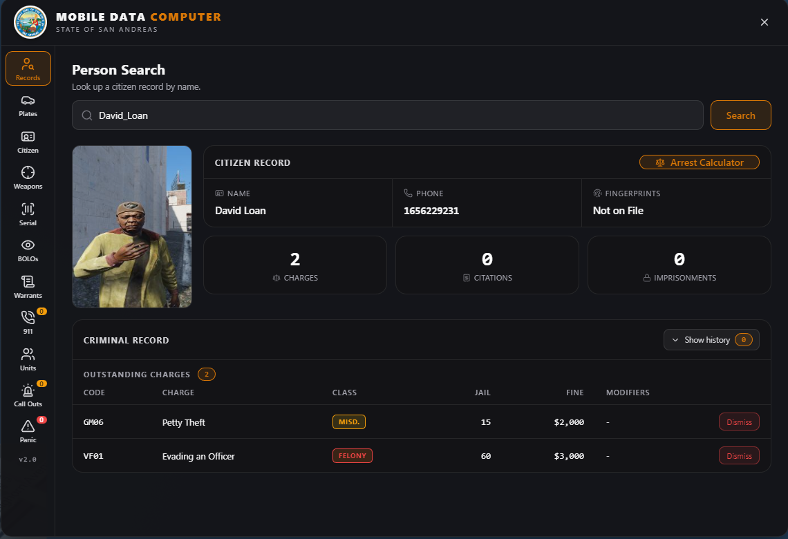

</div>

Ships targeting **Qbox** (`qbx_core`), but every framework and database call
lives behind two adapter files, so porting is a contained job rather than a
rewrite. See [Porting](#porting-to-another-framework).

## Scope

This is the **interface and the record layer**. It deliberately does not ship a
dispatch system, a CCTV system or a prison system: most servers already run
their own, and a terminal that fights them is worse than one that reads from
them.

Where the MDC would otherwise need those systems, it exposes an export instead,
so your existing resources stay in charge:

| You already have | The MDC gives you |
| --- | --- |
| A jail / prison resource | `RecordImprisonment` to log a conviction |
| A gun store / permit office | `RegisterWeapon` to file a firearm |
| A plate-change resource | `RecordPlateChange` to log plate history |
| A DMV | `startDmvPhoto` to take the licence portrait |

## Sections

| Section | What it does |
| --- | --- |
| **Record Search** | Citizen record, mugshot, criminal record. Outstanding charges always shown, prior record behind a toggle |
| **Citizen ID** | Driver licence card and licences on file, with a DMV portrait kept separate from the mugshot |
| **Plate Search** | Plate lookup: owner, model, VIN, phone, plate history, and the owner's full record |
| **Weapon List** | Registered firearms by owner |
| **Weapon Search** | Lookup by serial, with missing / stolen flags |
| **Arrest Calculator** | Penal code with modifiers, multiple suspects per incident, records charges as outstanding |
| **BOLOs** | Alerts with images and a configurable expiry (default 24h) |
| **Warrants** | Derived from outstanding charges |
| **Units** | Who is on duty, by callsign |

Roles are enforced **server side on every callback**, not just hidden in the UI:

- `leo`: on-duty police (`job.type == 'leo'`)
- `court`: judge / lawyer, read-only, no operational sections

## Screenshots

### Records

A citizen record leads with the mugshot, identity and lifetime totals.
Outstanding charges are always visible; prior record sits behind a toggle, so
the default view answers "what are they wanted for right now".

| Two outstanding charges | History revealed, showing a dismissal |
| --- | --- |
|  | 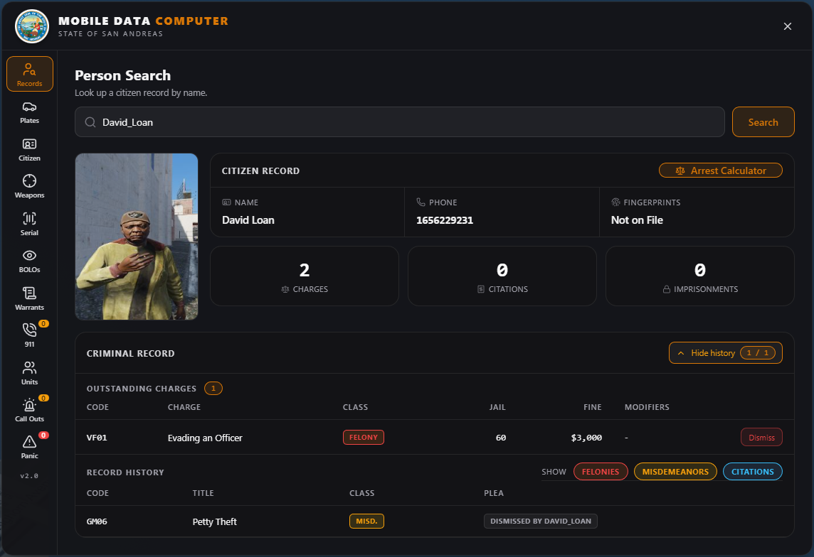 |

An empty search and a clean record read the same way, so a citizen with nothing
on file is unmistakable:

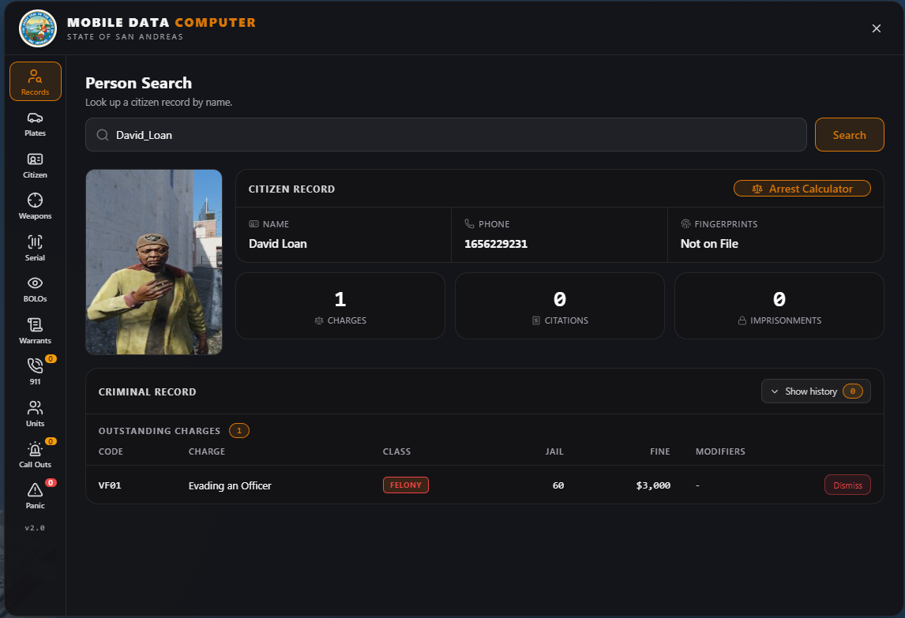

### Plate search

Running a plate answers *who am I about to stop*, not just *what is this car*.
The registration sits above the registered owner's full record, so outstanding
charges are on screen without scrolling. The `Dismiss` button and the
`Dismissed by David_Loan` row show the dismissal flow end to end.

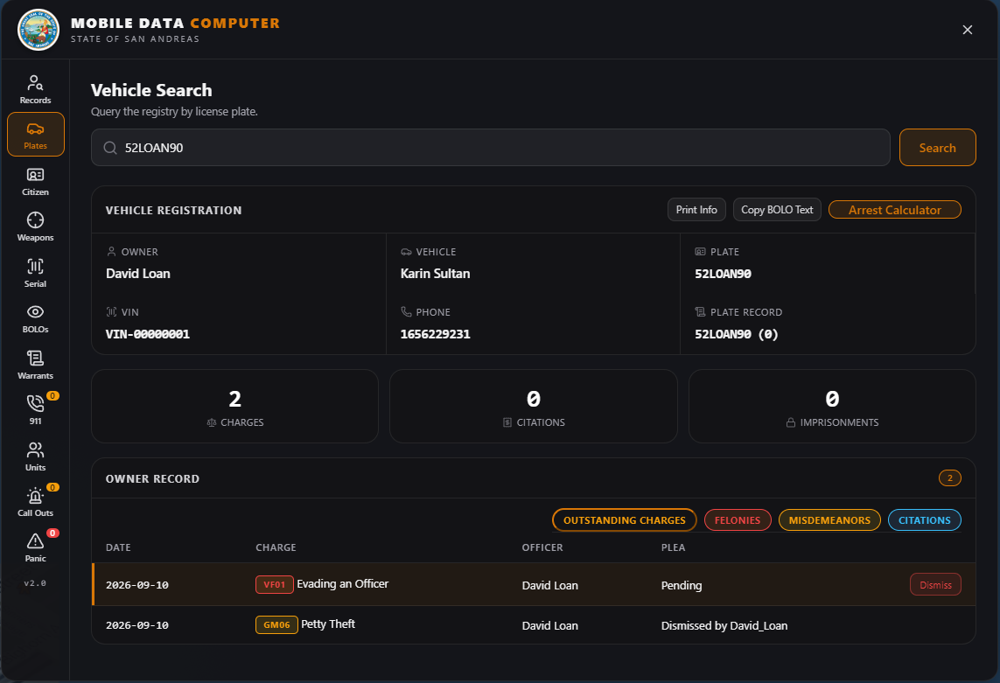

### Citizen ID

The driver licence card, with licences on file underneath. The portrait is the
one taken at the DMV, never the arrest mugshot.

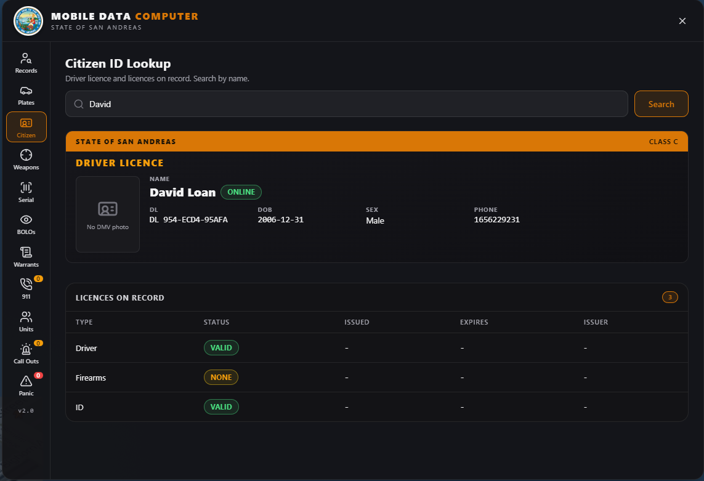

### Weapons

Registered firearms by owner, with a status per serial. `Toggle Missing` flips a
weapon in and out of missing from the serial lookup.

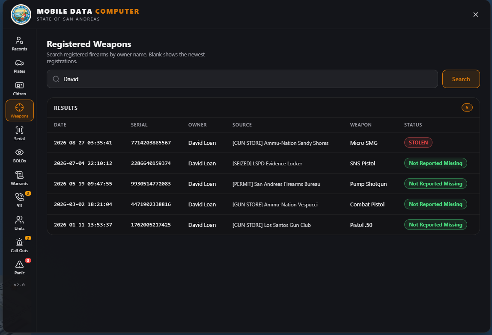

### Arrest calculator

The penal code with per-charge modifiers, a live jail and fine total, and
**multiple suspects per incident**: the same charge set is applied to everyone
involved, resolved server side before anything is written.

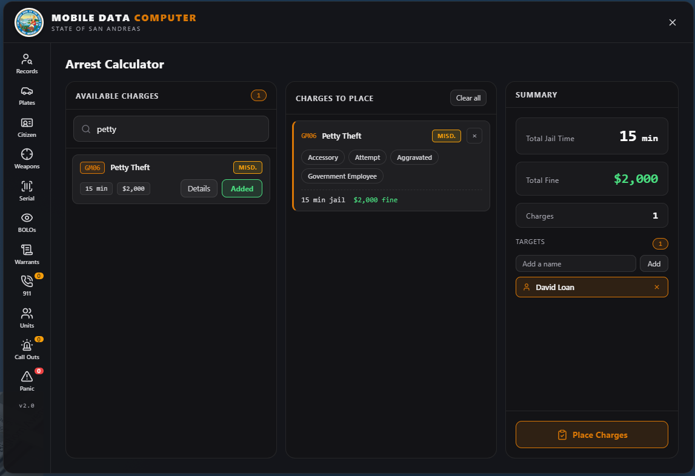

### BOLOs

Alerts carry multiple images with an inline carousel and a fullscreen viewer.
Each one has a configurable expiry, shown as a live countdown that turns red in
its final hour.

| Create and browse | Fullscreen viewer |
| --- | --- |
| 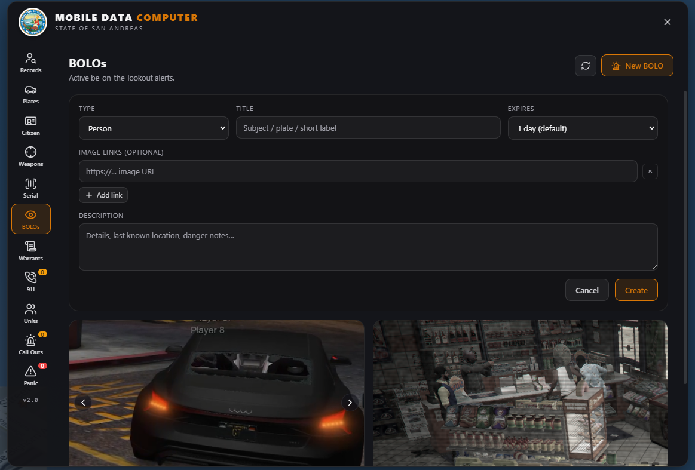 | 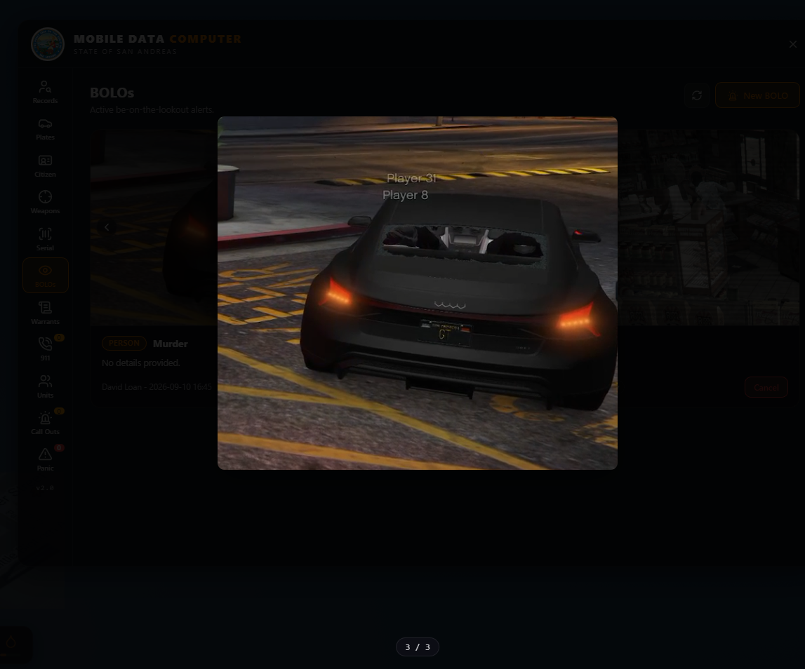 |

### Warrants and units

Warrants are derived from outstanding charges rather than tracked separately, so
they can never disagree with a citizen's record. Active Units groups officers
under their callsign.

| Warrants | Active units |
| --- | --- |
| 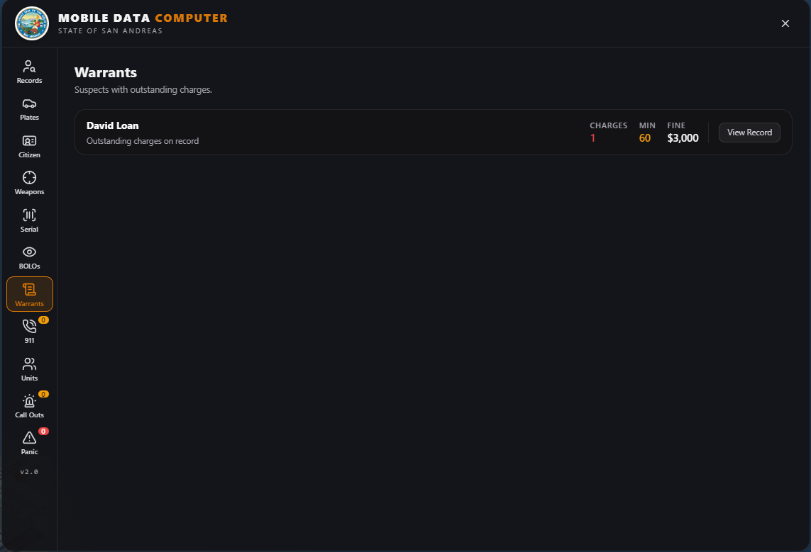 | 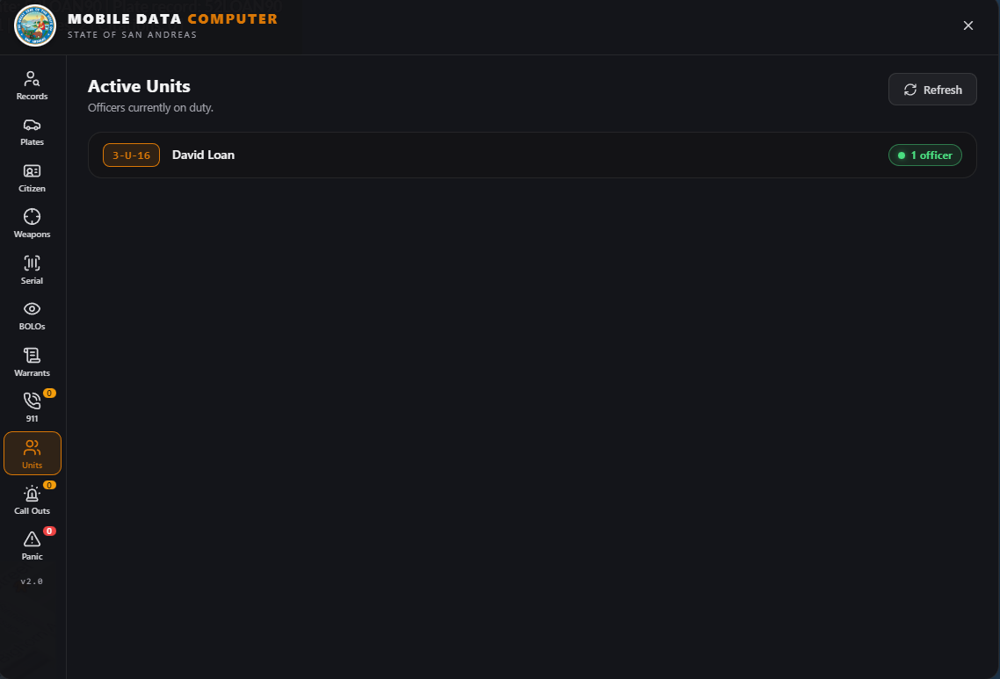 |

## BOLO text

"Copy BOLO Text" on a plate lookup builds a line from a template in
`config.lua`, so the wording matches how your department writes them:

```lua
Config.BoloText = {
    template = '{time} {date} | {detail} {model} | LP: {plate} | RO: {owner} | {extra}',
    detail = 'DETAIL_HERE',
    extra  = 'EXTRA_INFO',
}
```

Produces:

```
18:42 PM 10/SEP | DETAIL_HERE Coquette D5 | LP: H0PE | RO: Jimmi Jones | EXTRA_INFO
```

Tokens: `{time}` `{date}` `{detail}` `{model}` `{plate}` `{owner}` `{vin}`
`{phone}` `{charges}` `{extra}`. Unknown tokens are left alone rather than
blanked, so a typo is visible instead of silently eating text.

"Print Info" puts the record in chat rather than on the clipboard, so the
channel sees it.

## Dismissing a charge

Supervisors and the justice system can clear an outstanding charge from a
citizen's record without deleting it. The charge stops being outstanding, so it
no longer counts against the suspect and no longer raises a warrant, but it
stays on the record permanently stamped with who dismissed it, as
`Firstname_Lastname`.

```lua
Config.ChargeDismissal = {
    minLeoGrade = 3,             -- supervisors and above
    allowBoss   = true,          -- any job grade flagged isboss
    justiceJobs = { 'judge' },   -- add 'lawyer' if your server wants it
}
```

The button only renders for someone who qualifies, and **the server re-checks on
the callback**, so hiding it is not the control. Police supervisors must also be
on duty; the justice system is not duty-gated.

Dismissal is not reversible from the interface, so the button arms on first
click and commits on a second within a few seconds.

## Images

Mugshots and DMV portraits are the same capture pipeline with two destinations,
and they are stored the same way:

1. `screenshot-basic` takes a raw frame.
2. The MDC's **own NUI** downscales it to roughly 50KB and returns a data URI.
   Nothing depends on patching the screenshot resource's page.
3. The small data URI is sent to the server, which resolves the name to a
   citizen id and upserts it.

Because the image is already small, it is returned inline on lookup: no file
hosting, no external CDN, no image server. Uploads are rejected server side if
they are not a `data:image` URI or exceed 512KB.

The two images are deliberately **not** interchangeable. A licence shows the
portrait a citizen sat for at the DMV; a mugshot is taken of them after an
arrest. `mdc_mugshots` feeds Record Search, `mdc_dmv_photos` feeds Citizen ID,
and Citizen ID never falls back to a mugshot.

## Requirements

| Required | Optional |
| --- | --- |
| `qbx_core` | `screenshot-basic` for mugshots and DMV photos |
| `ox_lib` | `ox_inventory` for automatic firearm registration |
| `oxmysql` | |

Optional resources degrade gracefully when absent.

## Install

1. Drop the folder into your resources directory as `mdc`.
2. `ensure mdc` in `server.cfg`.
3. Restart. **The resource creates and migrates its own tables on start.**
   `sql/install.sql` is only there if you would rather review or apply the
   schema by hand.

Every table is namespaced `mdc_`. The resource never writes to your framework's
tables. It only reads them, and only through `server/bridge.lua`.

## Configuration

Everything an operator is expected to change is in `config.lua`.

```lua
Config.Command   = 'mdc'        -- /mdc
Config.Keybind   = 'F11'        -- false for no default key

Config.Notify.mode = 'ox_lib'   -- or 'chat' with your own template

Config.Bolo.defaultExpiryHours = 24
Config.Dmv.jobs  = { 'dmv' }    -- who may operate the licence camera
Config.Sections  = { ... }      -- hide a section entirely
```

`Config.Sections` hides a section's rail button **and** gates it server side, so
turning one off is a real restriction rather than a cosmetic one.

## Porting to another framework

Two files, nothing else:

```
server/bridge.lua   players, citizen records, vehicles
client/bridge.lua   the local player's job
```

Rewrite the function bodies and keep the documented return shapes. The rest of
the resource depends on those shapes and on nothing else. There are no framework
calls anywhere outside these two files.

```lua
Bridge.GetPlayer(src)            -> player | nil
Bridge.GetPlayers()              -> { [src] = player }
Bridge.SetMetadata(src, k, v)
Bridge.FindCitizenByName(query)  -> { cid, name, phone } | nil
Bridge.FindCitizenExact(f, l)    -> cid | nil
Bridge.GetCitizenCard(query)     -> { cid, name, dob, gender, phone, licences } | nil
Bridge.FindVehicleByPlate(plate) -> { cid, plate, model, vin, owner, phone } | nil
```

The shipped implementation reads `players.charinfo` and `player_vehicles` as
JSON. If your data lives behind an HTTP API or a different schema, replace the
SQL with whatever fetches it. Only the return shape matters.

If your framework has no job *types*, map your police jobs at the top of each
bridge and `job.type = 'leo'` is synthesised for you:

```lua
local JOB_TYPES = {
    ['police']  = 'leo',
    ['sheriff'] = 'leo',
}
```

## Integration points

```lua
-- open the MDC on the plate tab with a plate already searched (ANPR, radar)
TriggerEvent('mdc:runPlate', plate)

-- booking camera / DMV camera, from a target zone or command
exports.mdc:startBookingMugshot()
exports.mdc:startDmvPhoto()

-- file a firearm into the registry (gun store, permit office, evidence)
exports.mdc:RegisterWeapon(citizenid, ownerName, weapon, serial, sourceLabel)

-- log a conviction from your own jail system, clearing the charges it covered
exports.mdc:RecordImprisonment(citizenid, officer, months, fine, plea)

-- log a plate change so plate history stays accurate
exports.mdc:RecordPlateChange(vin, plate, note)
```

Incident reports have a server side (`getReports`, `getReport`, `createReport`)
with no UI section in this build. The callbacks are registered and relayed, so
you can drive them from your own panel or build a section on top of them.

Firearms are also filed automatically when `ox_inventory` stamps a serial, via
its `createItem` hook. Disable with `Config.Integrations.autoRegisterWeapons`.

## Commands

| Command | Who | Purpose |
| --- | --- | --- |
| `/mdc` | leo / court | Open the terminal (default F11) |
| `/dmvphoto` | DMV | Take a licence portrait |

## Notes

- Citizen ids are resolved server side and **never sent to the NUI**. The
  interface works entirely in names.
- Driver licence numbers are derived from the citizen id, so they are stable per
  character without exposing the id itself.
- The arrest calculator resolves every target before writing anything, so a
  multi-suspect incident cannot half apply.
- Icons are [Lucide](https://lucide.dev) (ISC), vendored as an inline sprite, so
  the NUI makes no outbound requests.

## Licence

MIT. See [LICENSE](LICENSE).
